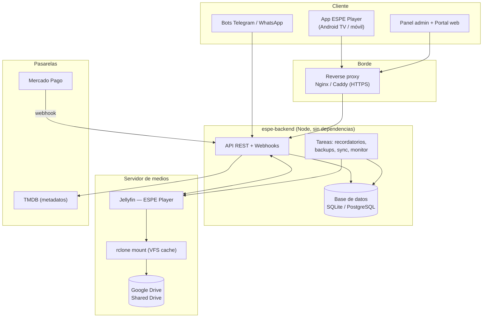
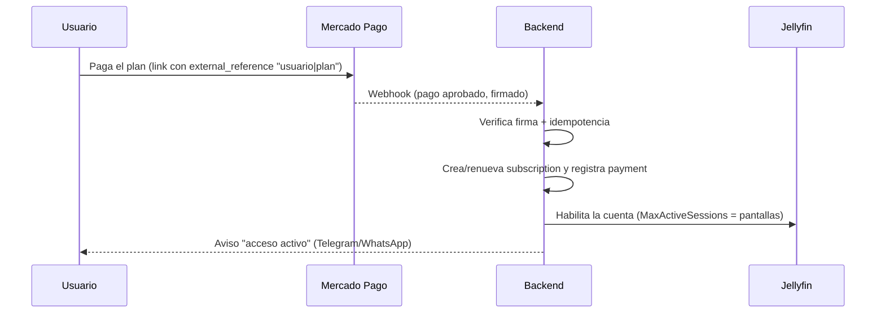
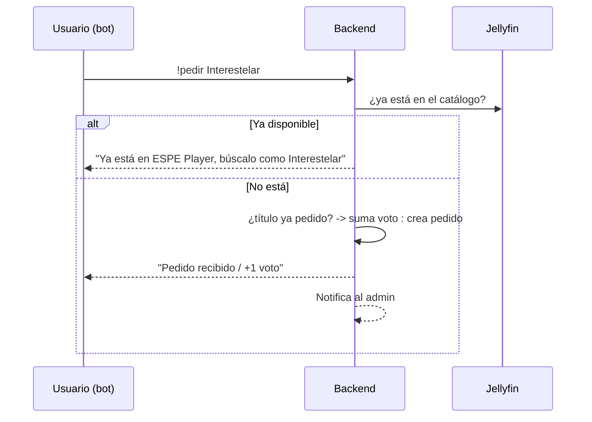

# Arquitectura — ESPE Player

Visión general de la plataforma de streaming **ESPE Player**: cómo encajan el
servidor de medios (Jellyfin), el almacenamiento (Google Drive + rclone), el
backend de suscripciones, los bots de pedidos, el panel y la app.

## Componentes

## Rol de cada pieza

| Componente | Función |
|---|---|
| **Jellyfin (ESPE Player)** | Sirve el video y controla el acceso real. Es el "candado": si la suscripción vence, el backend deshabilita la cuenta y no se puede reproducir. |
| **rclone + Google Drive** | El contenido vive en un **Shared Drive** de Google y se monta en el servidor con `rclone mount` (con caché VFS). Ver [INFRASTRUCTURE.md](INFRASTRUCTURE.md). |
| **espe-backend** | Cerebro del negocio: suscripciones, pagos, bots, catálogo, analítica. No sirve video; orquesta a Jellyfin vía su API. |
| **Base de datos** | Toda la información del negocio ([DATA-MODEL.md](DATA-MODEL.md)). |
| **Bots (Telegram/WhatsApp)** | Pedidos de contenido (`!pedir`, `!recomendaciones`, `!nuevos`) y avisos a los usuarios. |
| **App ESPE Player** | Cliente (fork de Jellyfin/Wholphin). Tras el login consulta el estado de la suscripción al backend. |
| **Mercado Pago** | Cobro automático; su webhook renueva la suscripción. |
| **TMDB** | Metadatos (títulos, sinopsis en español, pósters) para el catálogo y el autocompletado de pedidos. |
| **Reverse proxy** | HTTPS, dominio y protección delante del backend. |

## Flujos clave

### Alta y pago automático

### Pedido de contenido con votos

### Control de acceso (el candado)
- Cada acción de negocio (pago, revocación, baneo, vencimiento) sincroniza el estado en Jellyfin.
- Un **sweep** periódico (cada pocos minutos) deshabilita en Jellyfin lo que venció — clave para las **pruebas por horas**.
- Aunque alguien modifique la app, sin cuenta activa en Jellyfin **no hay reproducción**.

## Escalabilidad

- **Backend**: sin estado en memoria crítico (todo en la base). Se puede correr detrás del proxy y, con PostgreSQL, escalar a varias instancias.
- **Medios**: el cuello de botella real es la **cuota de la API de Google Drive**. Se resuelve con **rotación de cuentas de servicio** (ver INFRASTRUCTURE.md) y **caché VFS** de rclone.
- **Base**: empezar en SQLite (WAL) y migrar a PostgreSQL cuando haya muchos usuarios concurrentes o varios servidores.
- **Multi-servidor**: la tabla `servers` y `content_items.server_id` permiten repartir usuarios/contenido entre varios Jellyfin.

## Seguridad (resumen)

- HTTPS obligatorio en el borde (proxy); el backend habla HTTP en red interna.
- Contraseñas de staff hasheadas (scrypt); sesiones con expiración.
- Webhooks verificados por firma (Mercado Pago, WhatsApp).
- Rate limiting, cabeceras de seguridad, auditoría y backups (ya en el backend).
- Estado de la app firmado con HMAC opcional.

## Stack por capas

| Capa | Tecnología |
|---|---|
| Cliente | App ESPE Player (Android/AndroidTV), navegador |
| Borde | Nginx o Caddy (TLS, dominio) |
| Aplicación | Node.js (backend sin dependencias) |
| Datos | SQLite (WAL) → PostgreSQL |
| Medios | Jellyfin + rclone + Google Drive (Shared Drive) |
| Integraciones | Mercado Pago, TMDB, Telegram, WhatsApp Cloud API |
| SO / orquestación | Linux + systemd (o Docker Compose) |
