# Modelo de datos — ESPE Player

Documentación del esquema de base de datos ([`db/schema.sql`](../db/schema.sql)).
Es un diseño **relacional profesional** pensado para una plataforma de streaming
sobre Jellyfin: usuarios, suscripciones, pagos, catálogo, analítica de uso,
pedidos por bot, soporte e infraestructura (Google Drive + rclone).

> **Dialecto:** SQLite por defecto (cero infraestructura, un archivo). El mismo
> esquema migra a PostgreSQL cambiando tipos de fecha (`TEXT` → `TIMESTAMPTZ`) y
> `INTEGER PRIMARY KEY` → `BIGSERIAL`/`IDENTITY`. Ver notas `-- PG:` en el SQL.

## Principios de diseño

- **Dinero en centavos** (`INTEGER`): nunca coma flotante para importes.
- **Fechas ISO-8601 UTC** en texto (`2026-07-07T05:00:00Z`).
- **IDs externos separados**: `jellyfin_user_id`, `tmdb_id`, `gateway_ref` viven
  en columnas propias; las relaciones internas usan claves numéricas.
- **Borrado lógico** (`deleted_at`) en usuarios/admins: nunca se pierde historial.
- **Idempotencia** en pagos: `UNIQUE(gateway, gateway_ref)` evita acreditar dos veces.
- **Enums con `CHECK`**: los estados válidos están en la propia base.

## Diagrama de entidades (resumen)

```mermaid
erDiagram
    ROLES ||--o{ ADMINS : define
    ADMINS ||--o| RESELLERS : es
    ADMINS ||--o{ ADMIN_SESSIONS : abre
    RESELLERS ||--o{ RESELLER_LEDGER : mueve

    USERS ||--o{ USER_IDENTITIES : vincula
    USERS ||--o{ SUBSCRIPTIONS : tiene
    PLANS ||--o{ SUBSCRIPTIONS : define
    SUBSCRIPTIONS ||--o{ SUBSCRIPTION_REMINDERS : avisa
    USERS ||--o{ PAYMENTS : realiza
    PLANS ||--o{ PAYMENTS : corresponde
    PAYMENTS ||--o| INVOICES : genera
    COUPONS ||--o{ COUPON_REDEMPTIONS : canjea
    USERS ||--o{ REFERRALS : refiere

    SERVERS ||--o{ CONTENT_ITEMS : aloja
    CONTENT_ITEMS ||--o{ SEASONS : tiene
    SEASONS ||--o{ EPISODES : tiene
    CONTENT_ITEMS ||--o{ CONTENT_GENRES : clasifica
    GENRES ||--o{ CONTENT_GENRES : etiqueta
    CONTENT_ITEMS ||--o{ CONTENT_PEOPLE : reparto
    PEOPLE ||--o{ CONTENT_PEOPLE : participa
    COLLECTIONS ||--o{ COLLECTION_ITEMS : agrupa
    CONTENT_ITEMS ||--o{ COLLECTION_ITEMS : pertenece

    USERS ||--o{ DEVICES : registra
    USERS ||--o{ PLAYBACK_SESSIONS : reproduce
    CONTENT_ITEMS ||--o{ PLAYBACK_SESSIONS : se_ve_en
    USERS ||--o{ WATCH_HISTORY : continua
    USERS ||--o{ WATCHLIST : guarda
    USERS ||--o{ RATINGS : califica

    CONTENT_REQUESTS ||--o{ REQUEST_VOTES : recibe
    USERS ||--o{ SUPPORT_TICKETS : abre
    SUPPORT_TICKETS ||--o{ TICKET_MESSAGES : contiene
    USERS ||--o{ NOTIFICATIONS : recibe

    GDRIVE_SERVICE_ACCOUNTS ||--o{ GDRIVE_USAGE : consume
```



## Grupos de entidades

### 1. Configuración y operación
- **settings** — ajustes globales clave/valor (negocio, moneda, recordatorios…). Reemplaza al `settings.json` del backend actual.
- **servers** — nodos Jellyfin. Hoy uno (ESPE Player), preparado para crecer a varios.
- **audit_log** — quién hizo qué, cuándo y desde qué IP. Base de trazabilidad.

### 2. Staff, roles y revendedores (RBAC)
- **roles** — `owner`, `admin`, `support`, `reseller` con lista de permisos (JSON).
- **admins** — personal del panel; contraseña **hasheada con scrypt** (`algoritmo$salt$hash`).
- **admin_sessions** — tokens de sesión del panel (login con expiración, en vez de mandar la clave en cada request).
- **resellers / reseller_ledger** — revendedores con saldo de créditos y su libro mayor de movimientos.

### 3. Usuarios / suscriptores
- **users** — el suscriptor. Enlaza con Jellyfin (`jellyfin_user_id`), estado de cuenta (`active/suspended/banned/deleted`), país, locale, pantallas, a qué revendedor pertenece y quién lo refirió.
- **user_identities** — vincula el usuario con su chat de **Telegram** o número de **WhatsApp**, para que el bot lo reconozca (y a futuro consultar su propio plan).

### 4. Planes y suscripciones
- **plans** — catálogo de planes: precio, duración (días **u horas** para pruebas), pantallas, descargas, calidad (`SD/HD/FHD/4K`), si es prueba y si es público.
- **subscriptions** — la vigencia de cada usuario: estado, `expires_at`, autorrenovación, si es prueba.
- **subscription_reminders** — qué recordatorios de vencimiento ya se enviaron (evita duplicados; se reinicia al renovar).

### 5. Pagos, facturas, cupones, referidos
- **payments** — cada cobro: importe, método (`mercadopago/paypal/cash/transfer/crypto/reseller`), estado, referencia de pasarela (idempotente), JSON crudo para auditar.
- **invoices** — comprobantes numerados generados de pagos aprobados.
- **coupons / coupon_redemptions** — descuentos por porcentaje, monto fijo o días; con control de canjes.
- **referrals** — programa de referidos y recompensa en días.

### 6. Catálogo de contenido
Espejo enriquecido de la biblioteca de Jellyfin + metadatos de TMDB.
- **content_items** — películas y series: títulos, sinopsis en español, año, duración, rating, pósters, disponibilidad, fecha de alta.
- **seasons / episodes** — estructura de series.
- **genres / content_genres** — géneros (N:M).
- **people / content_people** — reparto y dirección (actor/director/guionista/creador).
- **collections / collection_items** — colecciones curadas (Estrenos, Tendencias…).

### 7. Dispositivos y analítica de uso
- **devices** — equipos por usuario (TV, celular, web); permite bloquear un dispositivo.
- **playback_sessions** — cada reproducción: contenido, dispositivo, duración, método (`DirectPlay/Transcode`), bitrate, IP, país. Base para **analítica** y **detección de cuentas compartidas**.
- **watch_history** — "continuar viendo" (posición por contenido).
- **watchlist / ratings** — mi lista y calificaciones (1–10, like/dislike).

### 8. Pedidos por bot (con votos)
- **content_requests** — pedidos de `!pedir`; título normalizado para agrupar duplicados, tipo, estado (`pendiente → aprobado → descargando → cumplido / rechazado`).
- **request_votes** — cada persona que pide un título ya existente suma un voto; la cola se ordena por votos.

### 9. Soporte y comunicación
- **support_tickets / ticket_messages** — mesa de ayuda con prioridad y asignación.
- **notifications** — registro de todo lo enviado (recordatorios, bienvenidas…).
- **notification_preferences** — qué quiere recibir cada usuario y por qué canal.
- **announcements** — novedades para la app/portal, segmentadas por audiencia.

### 10. Infraestructura Google Drive + rclone
- **gdrive_service_accounts** — las cuentas de servicio que rclone **rota** para repartir la cuota de la API de Drive (evita el `403 rate limit` con muchos usuarios). Incluye estado de cuota y última vez que dio 403.
- **gdrive_usage** — uso diario por cuenta (bytes, llamadas, errores) para rotación inteligente y monitoreo. Ver [INFRASTRUCTURE.md](INFRASTRUCTURE.md).

## Vistas incluidas
- **v_active_subscribers** — suscriptores vigentes con días restantes.
- **v_request_queue** — cola de pedidos ordenada por votos.
- **v_popular_content** — contenido más reproducido (reproducciones y espectadores únicos).

## Estados (enums) de referencia

| Entidad | Campo | Valores |
|---|---|---|
| users | status | active, suspended, banned, deleted |
| subscriptions | status | active, expired, cancelled, trial, grace |
| payments | status | pending, approved, rejected, refunded, chargeback |
| payments | method | mercadopago, paypal, cash, transfer, crypto, reseller, other |
| content_items | type | movie, series |
| content_requests | status | pendiente, aprobado, descargando, cumplido, rechazado |
| support_tickets | status | open, pending, resolved, closed |
| plans | quality | SD, HD, FHD, 4K |

## Cómo cargar la base

```bash
# SQLite (recomendado para empezar)
sqlite3 espe.db < db/schema.sql
sqlite3 espe.db < db/seed.sql
```

Ver [db/README.md](../db/README.md) para PostgreSQL y para conectar el backend.
