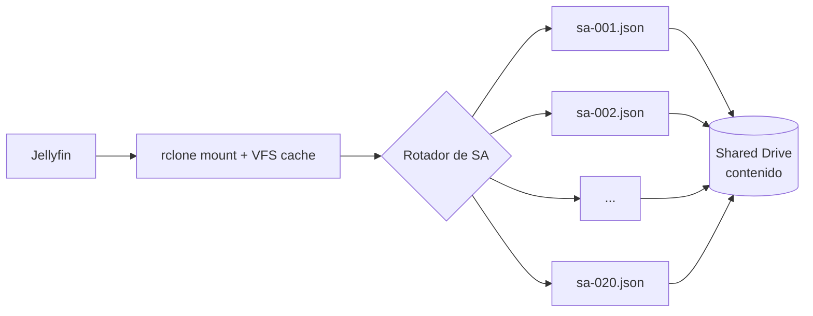

# Infraestructura — Jellyfin + rclone + Google Drive (ESPE Player)

Guía profesional para montar el servidor de medios de ESPE Player con el
contenido en **Google Drive** vía **rclone**, y cómo evitar el bloqueo de la
**API de Google** cuando hay muchos usuarios simultáneos.

> **Nota de cumplimiento.** Repartir carga entre varias cuentas de servicio es
> una técnica común de autohospedaje, pero puede chocar con los límites y
> términos de Google. Usá contenido que tengas derecho a alojar, revisá los
> Términos de Google Workspace/Drive y, si el proyecto crece, considerá una
> opción oficial (plan Workspace con más almacenamiento, o aumento de cuota).
> Este documento describe la configuración técnica; la responsabilidad de uso
> es tuya.

---

## 1. El problema de la cuota de la API

Google Drive no limita "cuántos usuarios ven", sino el **uso de su API** por
proyecto/cuenta. Los límites que importan:

- **Descarga por archivo/día**: un mismo archivo muy solicitado puede dar
  `403: The download quota for this file has been exceeded`.
- **Cuota de API por proyecto**: llamadas por 100 s y por día; al pasarse llega
  `403: userRateLimitExceeded` / `rateLimitExceeded`.
- **Subida**: ~750 GB/día por cuenta.

Con **muchos usuarios simultáneos**, un solo par (cuenta + proyecto) satura la
API y aparecen cortes o buffering. **Eso es lo que leíste.**

### La solución: rotación de cuentas de servicio ("los 100 bots")
No son bots: son **Service Accounts (SA)** de Google Cloud — cuentas de robot
con su propio archivo `.json` de credenciales. Cada SA aporta **su propia cuota
de API**. Si agregás varias SA a un **Shared Drive** y rclone **rota** entre
ellas, repartís la carga y evitás el 403. Con 10–20 SA suele alcanzar de sobra;
"100" es solo el máximo por proyecto (100 SA/proyecto).



---

## 2. Preparar las cuentas de servicio (una vez)

1. En [Google Cloud Console](https://console.cloud.google.com): creá un proyecto.
2. Habilitá **Google Drive API**.
3. Creá varias **Service Accounts** y descargá su `.json` (o generalas por lote).
4. Creá un **Shared Drive** (Unidad compartida) y **agregá cada email de SA**
   (`xxx@proyecto.iam.gserviceaccount.com`) como **Administrador de contenido**.
5. Guardá todos los `.json` en una carpeta, ej. `/opt/espe/sa/` (`sa-001.json`, …).

> El script [`scripts/rclone/rotate-service-accounts.sh`](../scripts/rclone/rotate-service-accounts.sh)
> ayuda a elegir/rotar el `.json` a usar. La generación masiva de SA se hace con
> `gcloud` o herramientas comunitarias; acá asumimos que ya tenés los `.json`.

Registrá cada SA en la base (`gdrive_service_accounts`) para monitorear su cuota.

---

## 3. Configurar rclone

Plantilla completa en [`scripts/rclone/rclone.conf.example`](../scripts/rclone/rclone.conf.example).
Idea general:

```ini
# Remote base contra el Shared Drive (rota service accounts)
[gdrive]
type = drive
scope = drive
service_account_file = /opt/espe/sa/sa-001.json
team_drive = 0AXXXXXXXXXXXXXXXXX          ; ID del Shared Drive
# rclone soporta rotación integrada de SA en operaciones de larga duración:
service_account_file_path = /opt/espe/sa/  ; carpeta con todos los .json

# Capa de cifrado opcional (recomendada)
[gcrypt]
type = crypt
remote = gdrive:media
password = ****
password2 = ****
```

- `service_account_file_path` hace que rclone **rote automáticamente** entre los
  `.json` de la carpeta cuando una SA se topa con la cuota.
- `team_drive` = ID del **Shared Drive** (mejor que "Mi unidad": cuota compartida y estable).
- La capa **crypt** es opcional pero recomendable para proteger el contenido.

---

## 4. Montar con caché (clave para streaming)

El montaje con **VFS cache** reduce drásticamente las llamadas a la API y el
buffering (rclone sirve desde disco lo ya leído):

```bash
rclone mount gdrive: /mnt/espe \
  --allow-other \
  --dir-cache-time 168h \
  --vfs-cache-mode full \
  --vfs-cache-max-size 100G \
  --vfs-cache-max-age 168h \
  --vfs-read-chunk-size 32M \
  --vfs-read-chunk-size-limit 512M \
  --buffer-size 256M \
  --poll-interval 15s \
  --drive-chunk-size 64M \
  --log-file /var/log/rclone.log
```

Parámetros que más ayudan con muchos usuarios:
- `--vfs-cache-mode full` + `--vfs-cache-max-size`: cachea en disco lo reproducido.
- `--dir-cache-time 168h` + `--poll-interval`: menos listados a la API (Drive avisa cambios).
- `--vfs-read-chunk-size`: arranca chico y crece; ideal para "adelantar" en el player.

Unidades **systemd** listas en [`scripts/systemd/`](../scripts/systemd/) para que
el mount y Jellyfin arranquen solos y se reinicien si fallan.

---

## 5. Jellyfin apuntando al mount

- Agregá `/mnt/espe/...` como bibliotecas (Películas, Series) en Jellyfin.
- **Desactivá** análisis pesados innecesarios (chapter images, extracción constante)
  para no golpear la API: bibliotecas → *Fetch subtitles*/*Extract chapter images* off.
- Programá el escaneo de biblioteca en horarios de baja demanda.

### Transcodificación
El transcoding es CPU/GPU intensivo. Recomendado:
- Habilitá **aceleración por hardware** (VAAPI/NVENC/QSV) si el servidor tiene GPU.
- Limitá bitrate por plan (ver `plans.quality`: SD/HD/FHD/4K).
- Idealmente **Direct Play** (que el cliente reproduzca sin transcodificar) → menos CPU.

---

## 6. Monitoreo de cuota y rotación inteligente

- El backend ya trae un **monitor de Jellyfin** (avisa por Telegram si se cae).
- Para las SA: registrá el uso diario en `gdrive_usage` (bytes, llamadas, `errors_403`).
  Así podés **saltar** la SA que se topó con la cuota y priorizar las libres.
- Señal de alerta: aumento de `403` en `rclone.log` → sumar SA o revisar caché.

---

## 7. Buenas prácticas de producción

- **Reverse proxy** (Nginx/Caddy) con HTTPS delante de Jellyfin y del backend.
- **Backups**: la base del backend ya se respalda; respaldá también `rclone.conf`
  y la carpeta de SA (cifrada).
- **Disco de caché** en SSD para la VFS cache.
- **Zona horaria** del servidor correcta (afecta cuota diaria y recordatorios).
- **Actualizaciones**: fijá versión de Jellyfin y probá antes de actualizar.

---

## 8. Checklist rápido

- [ ] Shared Drive creado con el contenido.
- [ ] N service accounts creadas y agregadas al Shared Drive.
- [ ] `.json` en `/opt/espe/sa/` y `service_account_file_path` configurado.
- [ ] `rclone mount` con VFS cache en SSD (unidad systemd).
- [ ] Jellyfin con bibliotecas sobre el mount y hardware transcoding.
- [ ] Reverse proxy con HTTPS.
- [ ] SA registradas en `gdrive_service_accounts`; monitoreo de `403`.
- [ ] Backups de base + `rclone.conf` + SA.
